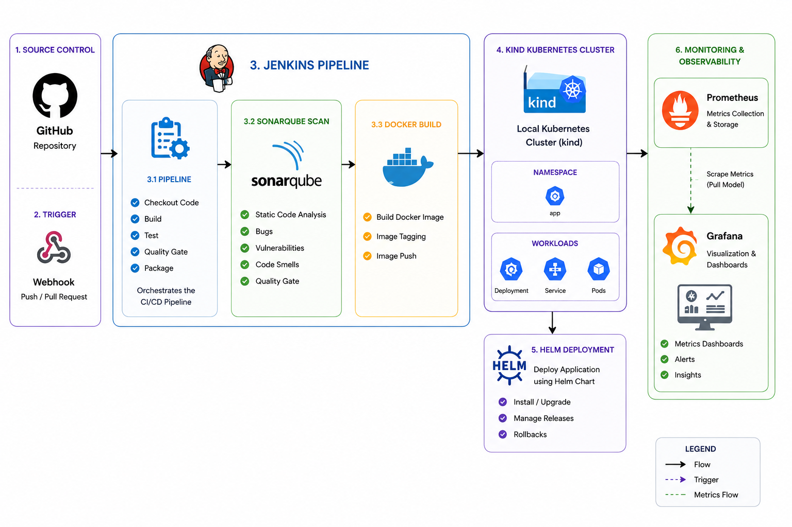
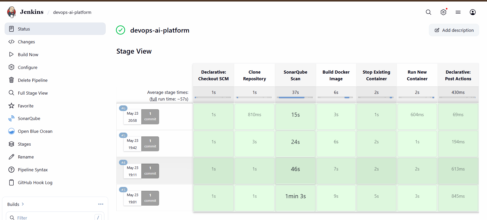
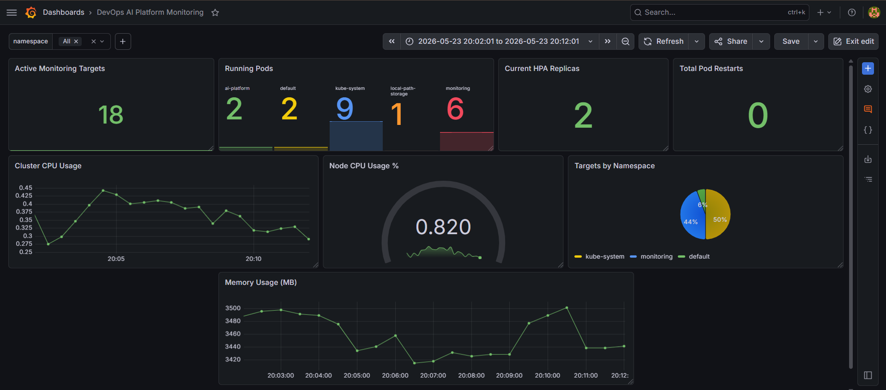
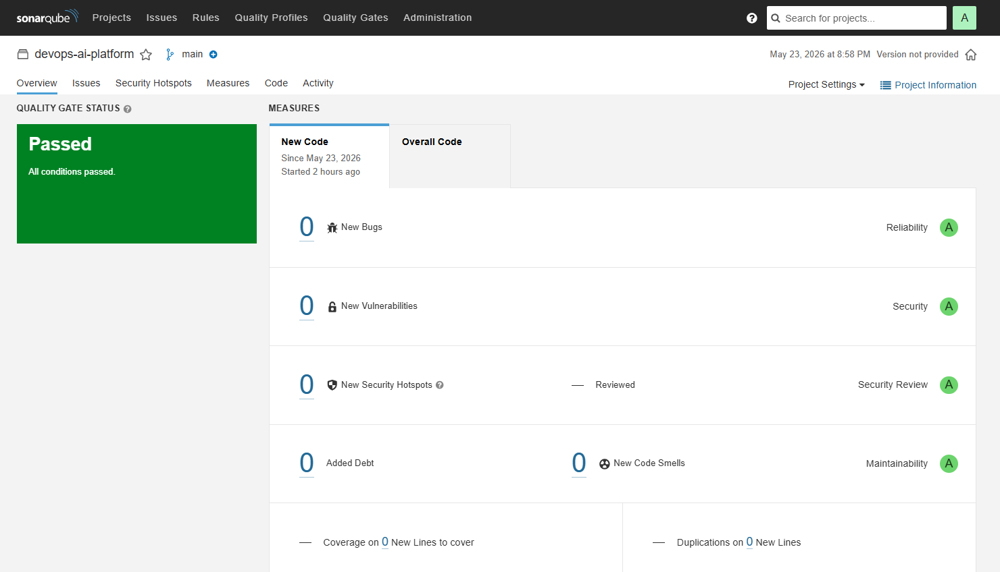

# DevOps AI Platform

A production-style end-to-end DevOps project demonstrating CI/CD, containerization, Kubernetes orchestration, autoscaling, observability, and infrastructure monitoring using modern DevOps tooling.

---

# Architecture



---

# Features

## CI/CD

* Automated Jenkins pipeline
* GitHub webhook integration
* Continuous deployment workflow
* Docker image automation

## Code Quality

* SonarQube static analysis
* Code quality scanning
* Vulnerability analysis

## Containerization

* Dockerized FastAPI application
* Optimized container builds
* Health checks

## Kubernetes

* Deployment management
* ReplicaSets
* Services
* Health probes
* Self-healing pods

## Helm

* Parameterized deployments
* Upgrade support
* Rollback support

## Autoscaling

* Horizontal Pod Autoscaler (HPA)
* CPU-based scaling
* Dynamic replica management

## Observability

* Prometheus metrics collection
* Grafana dashboards
* Cluster monitoring
* Resource telemetry
* Namespace-aware dashboards

---

# Tech Stack

## DevOps

* Jenkins
* Docker
* Kubernetes
* Helm
* Terraform

## Monitoring

* Prometheus
* Grafana

## Code Quality

* SonarQube

## Backend

* FastAPI
* Python 3.11
* Prometheus Client

## Platform

* kind Kubernetes Cluster
* Docker Desktop
* GitHub Webhooks

---

# Project Structure

```text
devops-ai-platform/
│
├── app/
│   ├── main.py
│   ├── Dockerfile
│   └── requirements.txt
│
├── jenkins/
│   └── Jenkinsfile
│
├── kubernetes/
│   ├── manifests/
│   └── helm/
│
├── monitoring/
│
├── docs/
│
├── sonar-project.properties
│
└── README.md
```

---

# CI/CD Pipeline

```text
GitHub Push
    ↓
Webhook Trigger
    ↓
Jenkins Pipeline
    ↓
SonarQube Scan
    ↓
Docker Build
    ↓
Kubernetes Deployment
    ↓
Helm Upgrade
```

---

# Monitoring Dashboard

The Grafana dashboard includes:

* Active monitoring targets
* Running pod count
* Cluster CPU usage
* Cluster memory usage
* HPA replica tracking
* Namespace distribution
* Node resource utilization

---

# Kubernetes Features

## Implemented

* Deployments
* Services
* ReplicaSets
* Readiness Probes
* Liveness Probes
* Resource Limits
* Horizontal Pod Autoscaler

## Observability

* Prometheus metrics scraping
* Grafana visualization
* Cluster telemetry
* Resource monitoring

---

# Local Setup

## Prerequisites

Install:

* Docker Desktop
* kubectl
* Helm
* kind
* Python 3.11
* Jenkins
* Git

---

# Clone Repository

```bash
git clone https://github.com/Zaid2044/devops-ai-platform.git

cd devops-ai-platform
```

---

# Create Virtual Environment

```bash
python -m venv venv
```

## Windows

```bash
.\venv\Scripts\Activate.ps1
```

---

# Install Dependencies

```bash
pip install -r app/requirements.txt
```

---

# Create kind Cluster

```bash
kind create cluster --name devops-local
```

---

# Deploy Application

## Apply Namespace

```bash
kubectl apply -f kubernetes/manifests/namespace.yaml
```

## Deploy with Helm

```bash
helm install devops-ai-platform ./kubernetes/helm/devops-ai-platform
```

---

# Run Jenkins

```bash
docker run -d \
  --name jenkins \
  --restart unless-stopped \
  --network devops-network \
  -u root \
  -p 8080:8080 \
  -p 50000:50000 \
  -v jenkins_home:/var/jenkins_home \
  -v /var/run/docker.sock:/var/run/docker.sock \
  jenkins/jenkins:lts
```

---

# Run SonarQube

```bash
docker run -d \
  --name sonarqube \
  --network devops-network \
  -p 9000:9000 \
  sonarqube:lts-community
```

---

# Monitoring Stack

## Install kube-prometheus-stack

```bash
helm install monitoring prometheus-community/kube-prometheus-stack \
-n monitoring
```

---

# Access Grafana

```bash
kubectl port-forward svc/monitoring-grafana 3000:80 -n monitoring
```

Grafana:

```text
http://localhost:3000
```

---

# Access Prometheus

```bash
kubectl port-forward svc/monitoring-kube-prometheus-prometheus \
9090:9090 \
-n monitoring
```

Prometheus:

```text
http://localhost:9090
```

---

# Autoscaling

## Create HPA

```bash
kubectl autoscale deployment devops-ai-platform \
--cpu=50% \
--min=2 \
--max=6
```

---

# Metrics

Application exposes Prometheus metrics:

```text
/metrics
```

Includes:

* inference_requests_total
* application health metrics
* Kubernetes telemetry

---

# Screenshots

## Jenkins Pipeline



---

## Grafana Dashboard



---

## SonarQube Analysis



---

# Future Improvements

* AWS EKS deployment
* Terraform infrastructure provisioning
* Ansible configuration management
* HashiCorp Vault integration
* JFrog Artifactory integration
* GitHub Actions migration
* ArgoCD GitOps workflow
* Ingress Controller
* Slack alerts
* Persistent Volumes
* Canary deployments

---

# Learning Outcomes

This project demonstrates practical experience with:

* CI/CD pipelines
* Kubernetes orchestration
* Containerization
* Infrastructure monitoring
* Autoscaling
* Observability engineering
* DevOps automation
* Production-style workflows

---

# Author

Zaid
AIML Student | DevOps & AI Enthusiast

GitHub:
[https://github.com/Zaid2044](https://github.com/Zaid2044)

```